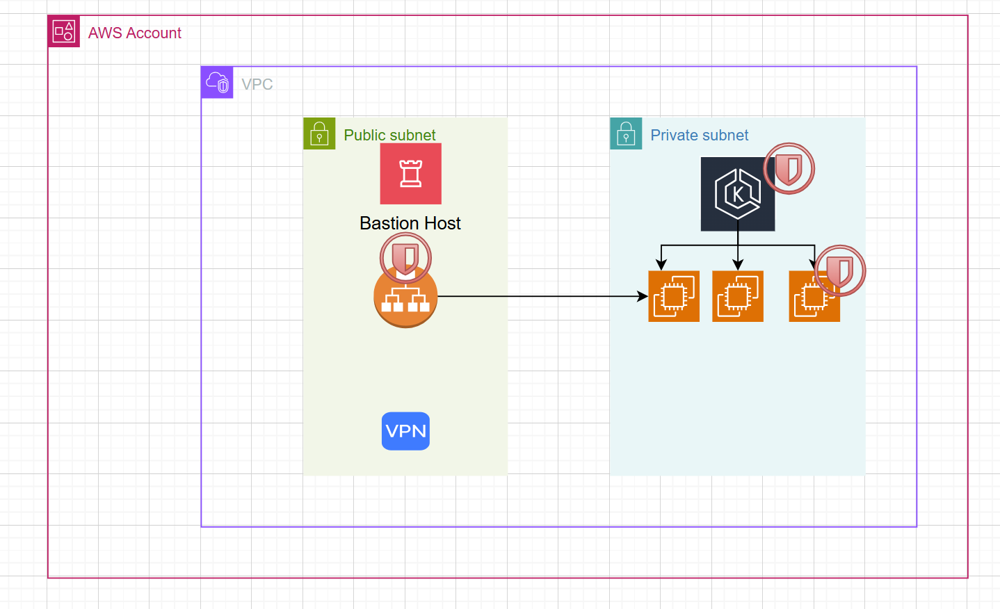

# Terraform EKS RoboShop Project

This repository contains a complete infrastructure-as-code solution for deploying the RoboShop microservices application on AWS EKS (Elastic Kubernetes Service).

## Project Structure and Components

### 1. Infrastructure as Code (`terraform/`)

The Terraform configurations create a production-grade EKS environment:

- **VPC Setup**: Multi-AZ deployment with public and private subnets
- **EKS Cluster**: Managed Kubernetes control plane with proper IAM roles
- **Node Groups**: Auto-scaling worker nodes with mixed instance types
- **Security**: Properly configured security groups and network ACLs
- **IAM Integration**: OIDC provider for pod-level AWS access

Key files:
- `main.tf`: Primary configuration entry point
- `vpc.tf`: Network infrastructure definition
- `eks.tf`: Cluster and node group specifications
- `iam.tf`: Permission management for cluster components
- `variables.tf`: Customizable parameters
- `outputs.tf`: Important references exported after deployment

### 2. Kubernetes Resources (`k8s-manifests/`)

Kubernetes manifest files that deploy the RoboShop application:

- **Namespaces**: Logical separation of application components
- **Deployments**: Container specifications for each microservice
- **Services**: Internal and external network endpoints
- **ConfigMaps**: Non-sensitive configuration
- **Storage**: Persistent volume claims for stateful services

Each microservice (cart, catalogue, user, etc.) has dedicated deployment configurations with appropriate resource limits and health checks.

### 3. RBAC Configuration (`k8-rbac/`)

Role-Based Access Control settings for secure cluster access:

- **Roles & ClusterRoles**: Permission definitions
- **RoleBindings**: User/group permissions assignment
- **ServiceAccounts**: Pod-level identities for AWS service access
- **Examples**: Practical implementations of common RBAC patterns

The `k8-service-account/` subfolder demonstrates how to securely access AWS services from pods using IAM roles for service accounts (IRSA).

### 4. Init Containers (`k8-initContainer/`)

Examples of initialization containers that run before main application containers:

- **Secret Retrieval**: Fetching credentials from AWS Secrets Manager
- **Database Preparation**: Schema setup and migration
- **Dependency Checking**: Validating required services
- **Volume Sharing**: Communication between init and main containers

The `manifest.yaml` provides a working example of using init containers to securely retrieve database credentials at runtime.

### 5. Helm Charts (`helm-charts/`)

Packaged Kubernetes applications for easier deployment:

- **RoboShop**: Complete application stack
- **Monitoring**: Prometheus and Grafana setup
- **AWS Integrations**: Load balancer controller and other AWS-specific tools

Templates are parameterized for different environments (dev, staging, production).

### 6. Automation Scripts (`scripts/`)

Utility scripts to simplify common operations:

- **Deployment**: End-to-end cluster and application setup
- **Cleanup**: Resource termination and cleanup
- **Maintenance**: Update and management utilities
- **Secret Management**: Tools for secure credential handling

## Getting Started

### Prerequisites

- AWS CLI configured with appropriate permissions
- Terraform v1.0.0+
- kubectl v1.24+
- helm v3.8+

### Deployment Steps

1. **Initialize Terraform**
   ```bash
   cd terraform
   terraform init
   ```

2. **Review and Apply Infrastructure**
   ```bash
   terraform plan
   terraform apply
   ```

3. **Configure kubectl**
   ```bash
   aws eks update-kubeconfig --region us-east-1 --name roboshop-eks
   ```

4. **Deploy RoboShop Application**
   ```bash
   # Using kubectl
   kubectl apply -f k8s-manifests/namespaces/
   kubectl apply -f k8s-manifests/configmaps/
   kubectl apply -f k8s-manifests/deployments/
   kubectl apply -f k8s-manifests/services/
   
   # OR using Helm
   helm upgrade --install roboshop helm-charts/roboshop/
   ```

5. **Verify Deployment**
   ```bash
   kubectl get pods -n roboshop
   kubectl get svc -n roboshop
   ```

## Security Features

- **Private Subnets**: Worker nodes run in private subnets
- **IAM Roles**: Least privilege principle applied to all components
- **IRSA**: Secure AWS service access without storing credentials
- **Network Policies**: Pod-to-pod communication restrictions
- **Secret Management**: External secrets stored in AWS Secrets Manager

## Maintenance Operations

- **Cluster Updates**: Process for upgrading EKS version
- **Node Rotation**: Refreshing worker nodes with minimal disruption
- **Scaling**: Horizontal and vertical scaling procedures
- **Backup & Restore**: Data protection strategies

## Troubleshooting

Common issues and their solutions:
- Authentication problems
- Networking issues
- Resource constraints
- AWS service integration errors

## Additional Resources

- [AWS EKS Documentation](https://docs.aws.amazon.com/eks/)
- [Terraform AWS Provider](https://registry.terraform.io/providers/hashicorp/aws/latest/docs)
- [Kubernetes Documentation](https://kubernetes.io/docs/home/)

## Contributing

Guidelines for contributing to this project:
- Code formatting standards
- Pull request process
- Testing requirements
- Documentation updates

---

**Note**: Customize variables in `terraform/variables.tf` to match your specific requirements before deployment.
